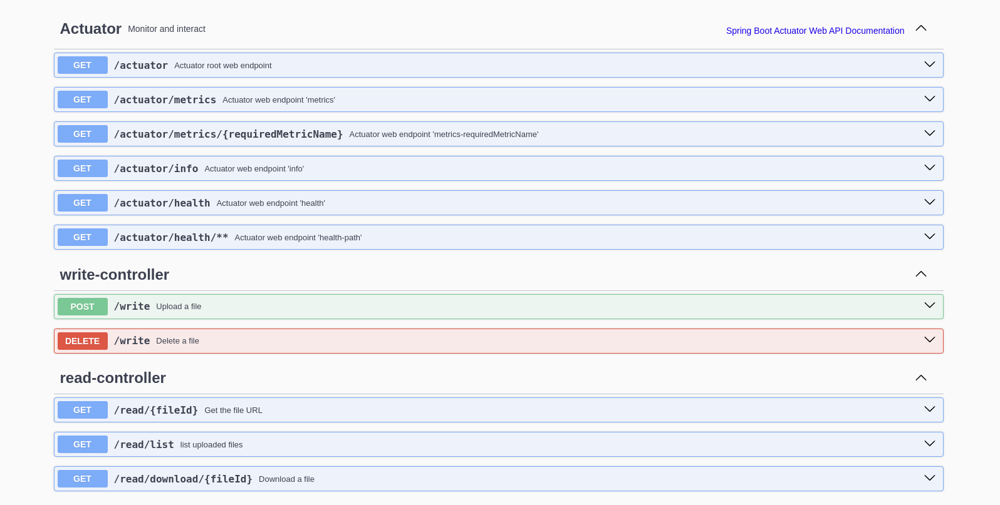

Visão geral do projeto/desafio:
    o projeto foi criado como prova de conceito que consome serviços do amazon S3. 
Visando um cenário real de conexão foi utilizado o localstack para poder simular o S3

Para rodar o projeto: 
    Dentro do diretório onde o projeto está salvo, deve-se rodar o seguinte comando:

    docker-compose up -d --build

O Swagger a aplicação vai estar disponivel na seguinte url: 

    http://localhost:8080/api/swagger-ui/index.html#

